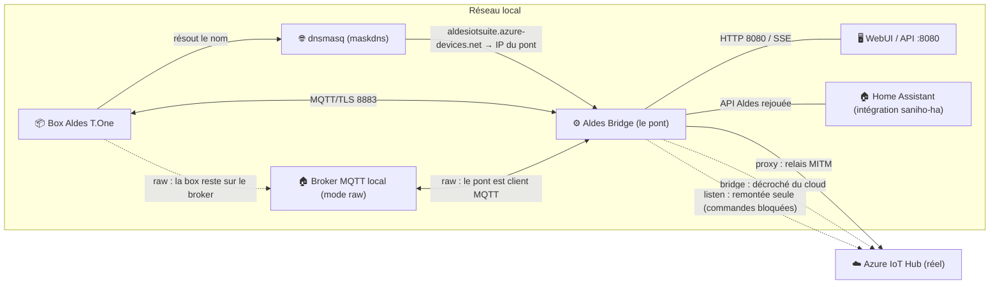
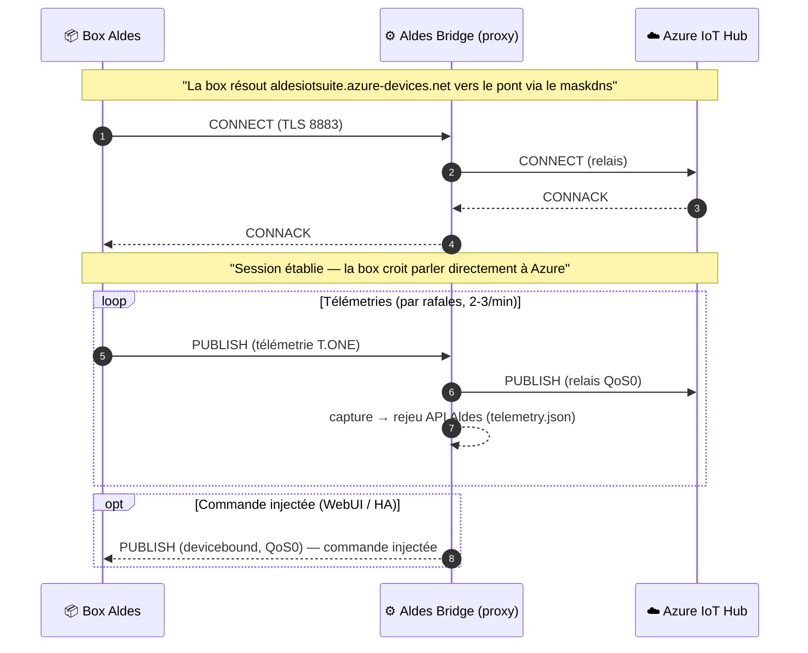
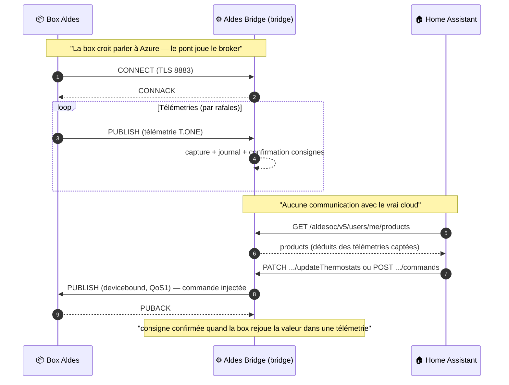
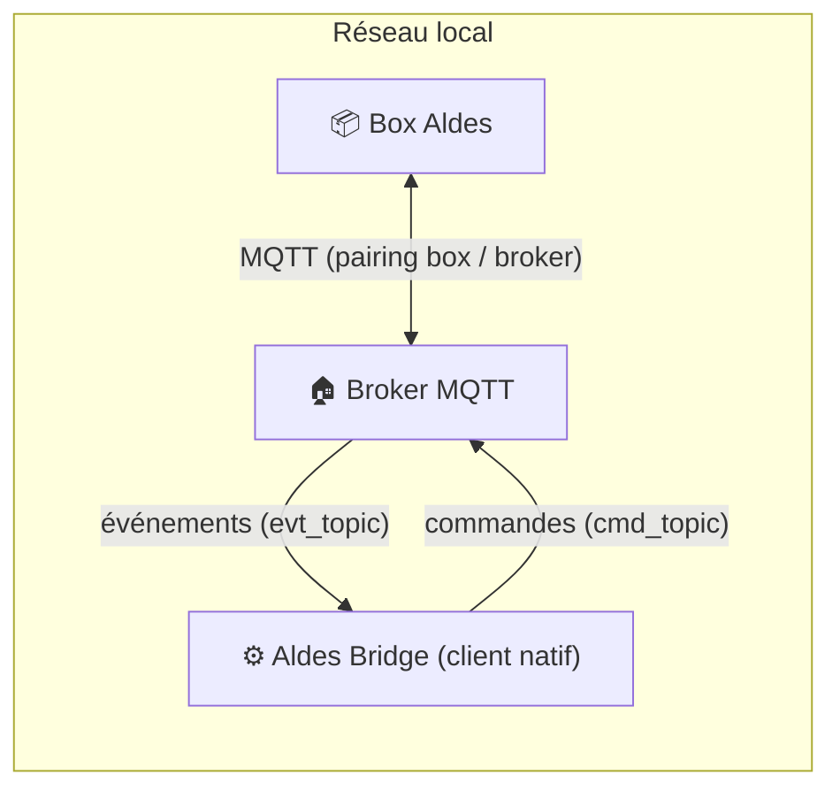
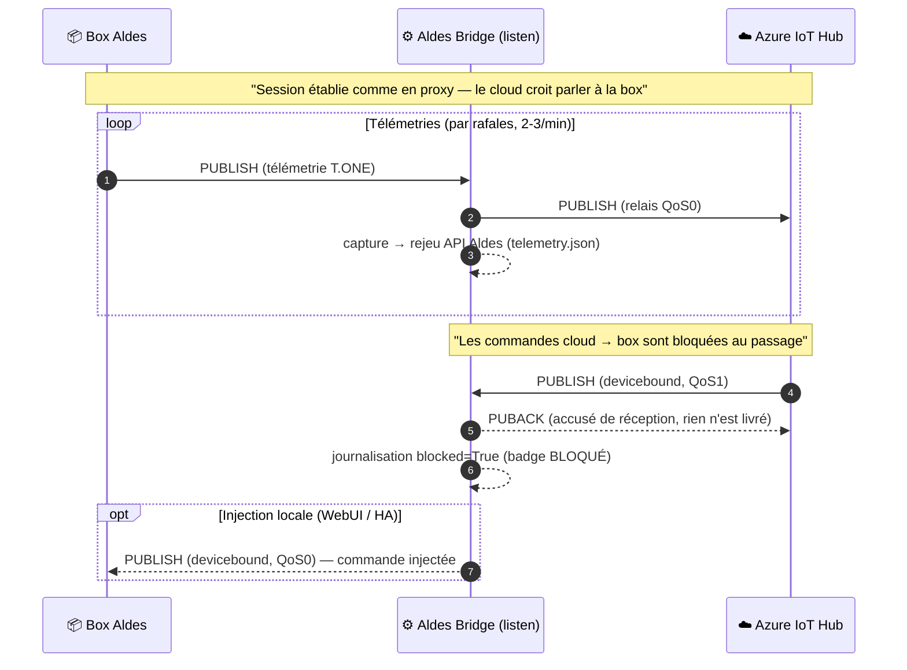

# Flux des modes — diagrammes Mermaid

Schémas interactifs (rendus nativement par GitHub) des quatre modes du pont :
**proxy**, **bridge**, **listen** et **raw**. L'ancien schéma ASCII vit dans le README.

## Vue d'ensemble

Le **maskdns** est le point d'entrée : la box résout `aldesiotsuite.azure-devices.net`
vers l'IP du pont. C'est lui qui décide si les trames passent par le pont (`proxy`) ou
n'atteignent jamais le vrai cloud (`bridge`).

## Mode proxy — MITM transparent

La box passe par le pont **pour rejoindre Azure** : le pont relaie chaque trame
(télémetries **et** acquittements), reste invisible côté cloud, et peut observer /
injecter des commandes au passage.

Points clés :

- le pont **termine** la connexion TLS de la box (`server/engine.py`) et ouvre **sa propre**
  connexion TLS vers Azure (`server/proxy.py`) ;
- relais **bidirectionnel** : télémetries box→Azure, commandes cloud→box ;
- les injections boxward passent en **QoS0** (pas de suivi d'acquittement) ;
- la WebUI et la capture télémetrie fonctionnent pendant le relais.

## Mode bridge — faux broker (local / hors-ligne)

La box se connecte au pont qui **joue le rôle d'Azure**. Rien ne sort vers le cloud :
le pont termine la connexion et sert l'API Aldes rejouée à Home Assistant.

Points clés :

- commandes injectées en **QoS1** (suivi PUBACK) ;
- le rejeu de l'API Aldes est **lecture des télémetries captées** + écriture vers la box
  via `engine.inject` (`devices/<boxid>/messages/devicebound`) ;
- la **confirmation** d'une consigne arrive quand la box rejoue la valeur (`UsC<n>`)
  dans une télémetrie ultérieure (`_confirm_consignes_from`).

## Mode raw — client MQTT natif (bonus)

Le pont n'écoute plus la box : il se connecte **en client** au broker local configuré,
écoute les événements sur `evt_topic` et publie les commandes sur `cmd_topic`.

## Mode listen — remontée seule (écoute du cloud)

Comme le proxy, la box rejoint Azure via le pont : la **télémétrie remonte** vers le
cloud à l'identique. Mais les **PUBLISH venant d'Azure** (commandes devicebound) sont
**bloqués** : observés et journalisés (`blocked=True`, badge « BLOQUÉ » dans la WebUI),
acquittés côté Azure pour éviter des retries, **jamais livrés à la box**. Les autres
trames cloud→box (CONNACK, SUBACK, PINGRESP, PUBACK/PUBREC/PUBCOMP des télémetries)
sont relayées pour garder la session MQTT de la box vivante.

Points clés :

- les commandes cloud→box sont **acquittées côté Azure** (QoS1 → PUBACK, QoS2 →
  PUBREC puis PUBCOMP à la réception du PUBREL) mais **jamais transmises** à la box ;
- l'injection locale (WebUI / API) reste possible en **QoS0** comme en proxy ;
- le mode sert à **observer** ce que le cloud voudrait envoyer sans l'appliquer —
  pratique pour tester la sûreté d'une intégration HA sans commande réelle.

## Glossaire

| Terme | Signification |
|---|---|
| **devicebound** | topic `devices/<boxid>/messages/devicebound` — commandes vers la box (JSON-RPC `changeMode`, `changeConsigneC<n>`) |
| **télémetrie T.ONE** | PUBLISH boxward : `MT0..MT9` températures, `UsC0..UsC9` consignes, `UAM`/`UDM` modes, `NED` ECS, `dt` horodatage cadran box |
| **maskdns** | dnsmasq qui redirige `aldesiotsuite.azure-devices.net` vers le pont (`setup-dns.sh`) |
| **rejeu API Aldes** | endpoints `/oauth2/token`, `/aldesoc/v5/users/me/products`, `/…/updateThermostats`, `/…/commands` servis par le pont pour l'intégration HA |
| **MITM** | interception + relais : le pont se fait passer pour Azure devant la box et pour la box devant Azure |